# AI-Assisted IT Support Incident Triage Assistant

## Project Status

✅ Completed

**Date:** September 2026  
**Category:** AI, IT Support, IT Operations

---

## Overview

This project explores how Generative AI can assist common IT Support and Service Desk workflows.

I built a small **Python-based prototype using Google's Gemini API** to analyse sample IT support tickets and generate structured recommendations for:

- Incident categorisation
- Priority recommendation
- Troubleshooting guidance
- Escalation criteria
- Draft incident documentation

The workflow follows a **human-in-the-loop approach**, where AI provides recommendations and a human reviews the output before operational decisions are made.

---

## Project Objective

The objective of this project was to explore how Generative AI can support IT Support and Service Desk teams by improving:

- Ticket triage
- Troubleshooting guidance
- Escalation recommendations
- Documentation quality

while maintaining human oversight and decision-making.

---

## Problem Statement

IT Support tickets often contain inconsistent descriptions and varying levels of detail, making initial triage and documentation more time-consuming.

This project explores how Generative AI can provide a structured starting point for IT Support analysts while keeping human judgement and validation in the workflow.

---

## Solution Architecture

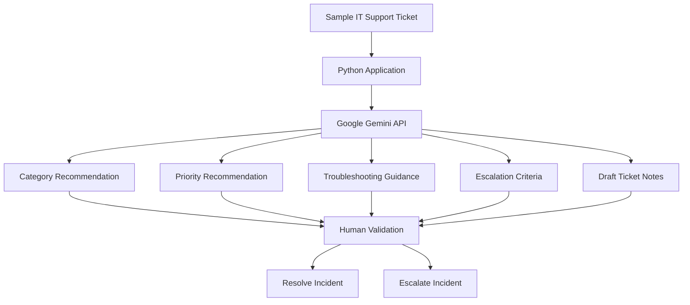

---

## Technologies Used

- Python
- Google Gemini API
- Pandas
- Prompt Engineering
- Git & GitHub
- IT Support / Service Desk Concepts
- Incident Management Concepts
- Responsible AI Principles

---

## Dataset

A fictional test dataset was created in:

```text
test_tickets.csv
```

Example incidents:

- Microsoft Teams Login Failure
- VPN Connectivity Issue
- Password Reset Request
- User Account Locked
- Suspicious Email Received
- MFA Issue

No real customer or organisational data was used.

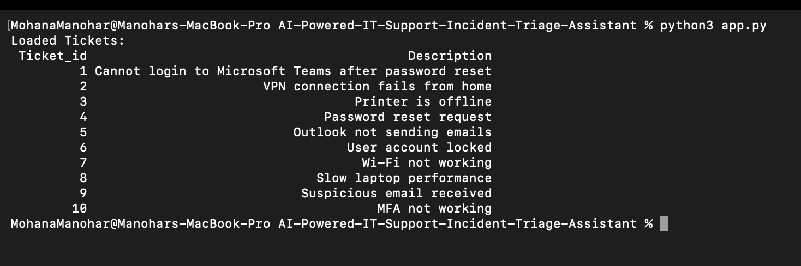
---

## AI Workflow

```text
IT Support Ticket
        ↓
Gemini AI Analysis
        ↓
Category + Priority
Troubleshooting
Escalation Criteria
Draft Documentation
        ↓
Human Validation
        ↓
Resolution / Escalation
```

AI outputs are treated as **recommendations rather than confirmed diagnoses**.

---

## Prompt Design

The prompt was designed to generate consistent and structured IT Support recommendations.

The model was instructed to:

- Categorise the incident
- Recommend a priority level
- Identify missing information
- Suggest initial troubleshooting actions
- Identify escalation conditions
- Draft concise ticket notes
- Distinguish recommendations from confirmed facts
- Avoid unsupported assumptions

The prompt was refined through testing to improve consistency and usefulness.

---

## Activities & Testing

### 1. Teams Login Incident

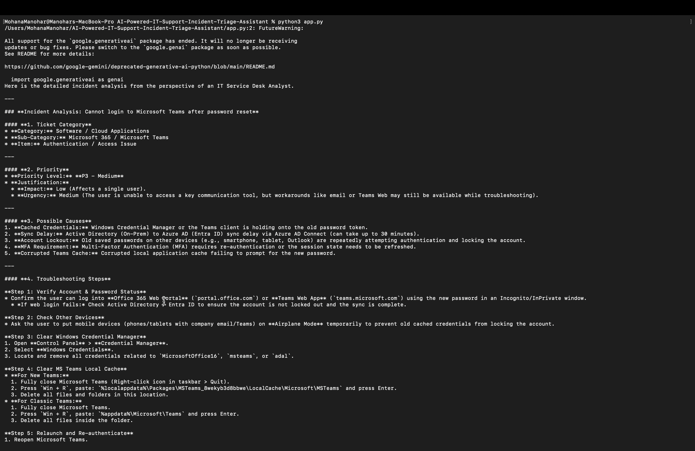

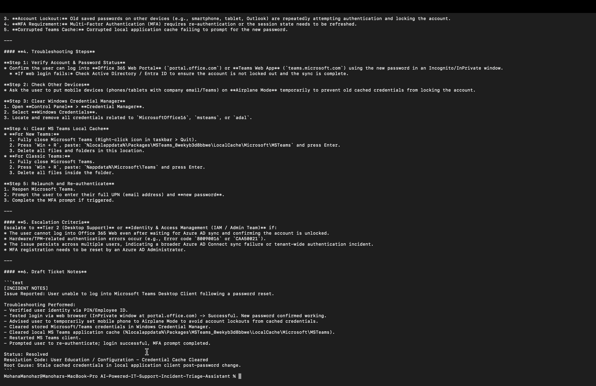

Tested the AI against an authentication-related incident and reviewed:

- Category
- Priority
- Troubleshooting steps
- Escalation criteria
- Draft documentation

---

### 2. VPN Connectivity Incident

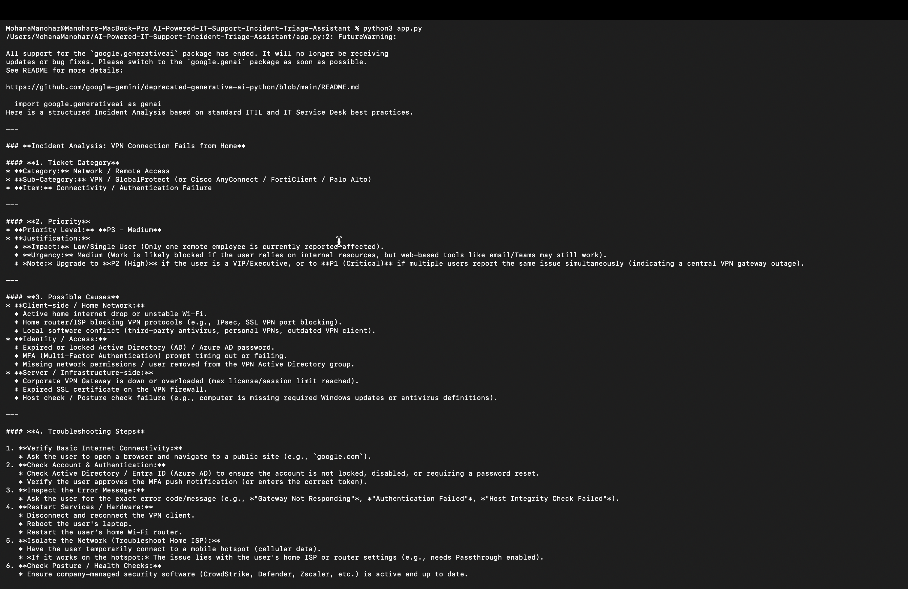

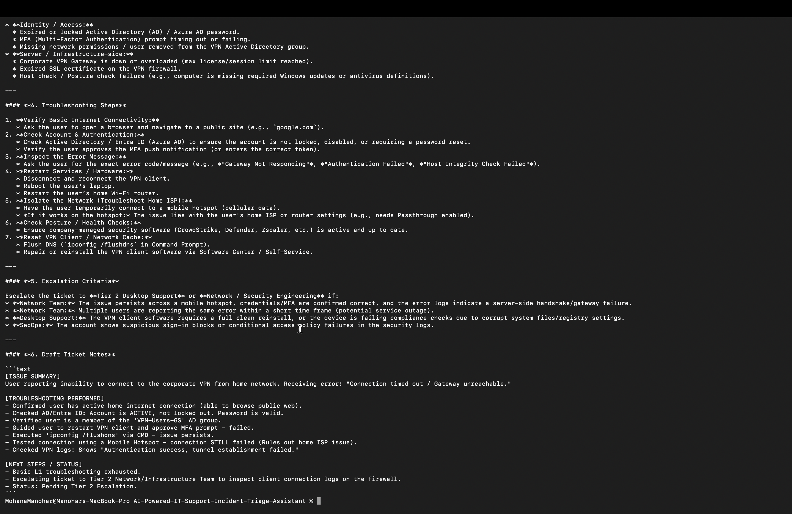

Tested a networking-related incident to evaluate troubleshooting recommendations and escalation guidance.

---

### 3. Suspicious Email Incident

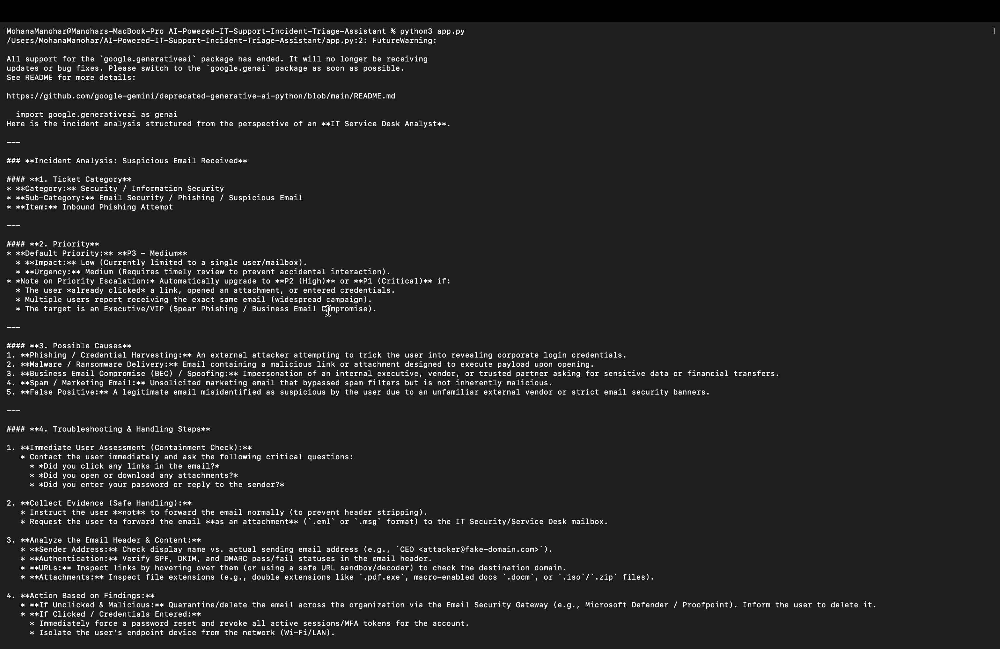

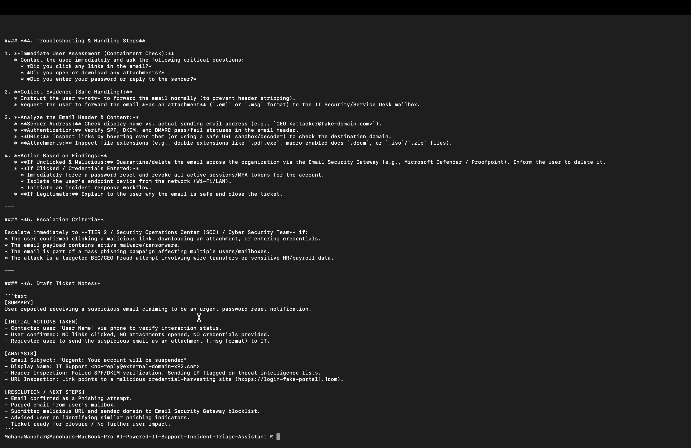

solving a suspicious email, focusing on investigation, containment and escalation guidance.

---

### Analysis Export

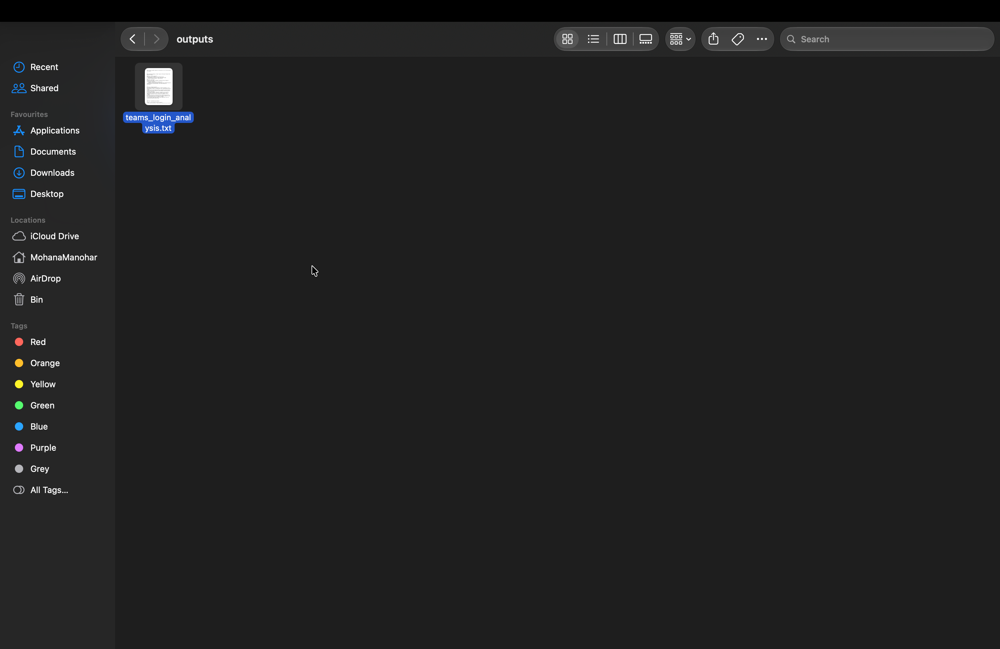

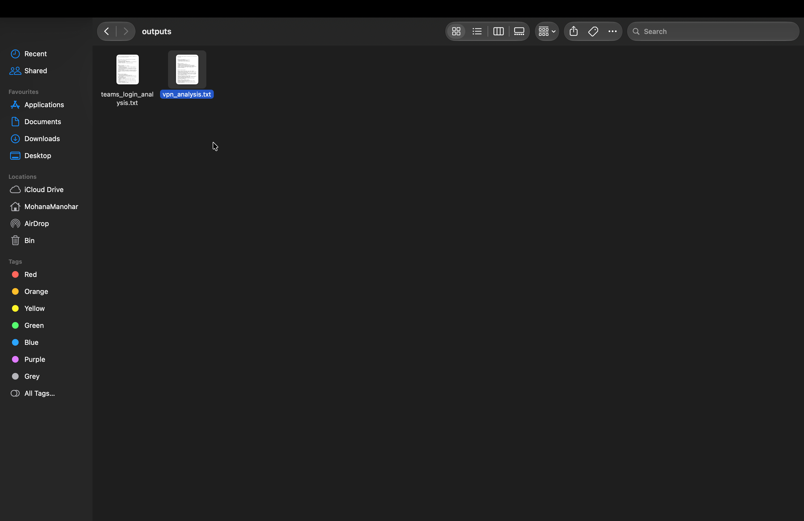

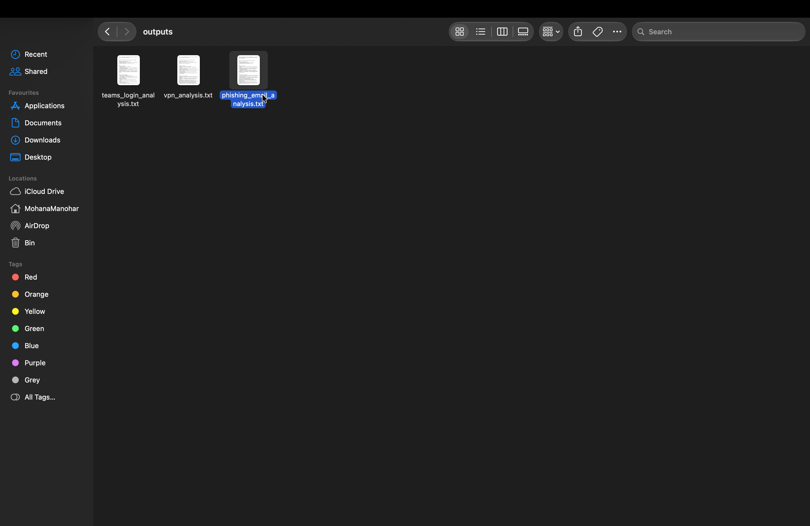

All AI-generated analyses were exported into reusable documentation files.

---

## Validation

AI outputs were manually reviewed against expected outcomes for:

- Category accuracy
- Reasonableness of priority
- Troubleshooting usefulness
- Escalation requirements

### Validation Results

| Ticket | Category Correct? | Troubleshooting Useful? | Human Review Required? |
|----------|----------|----------|----------|
| Teams Login Failure | Yes | Yes | Yes |
| VPN Connectivity Issue | Yes | Yes | Yes |
| Suspicious Email Received | Yes | Yes | Yes |

The testing demonstrated that the prototype produced useful and structured recommendations for the scenarios tested.

Human validation remained necessary before operational decisions were made.

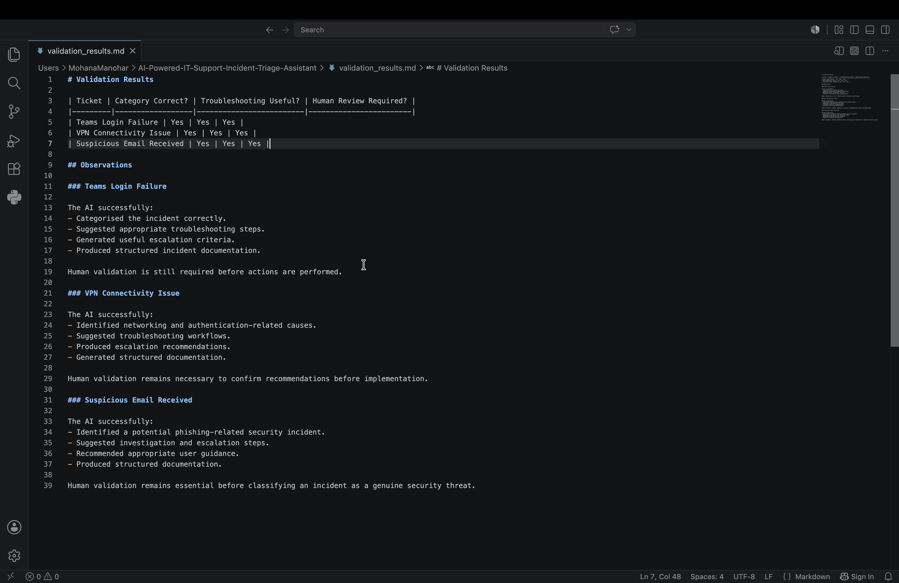

---

## Responsible AI Considerations

This project demonstrates how Generative AI can assist IT Support and Service Desk workflows.

AI recommendations are treated as guidance and must be reviewed by a human before operational decisions are made.

### Workflow

```text
AI Recommendation
        ↓
Human Review
        ↓
Decision
        ↓
Action
```

### Benefits

- Faster ticket triage
- Consistent troubleshooting guidance
- Improved documentation quality
- Support for Service Desk workflows
- Helps identify missing information

### Limitations

- AI responses may contain inaccuracies
- Human validation is required
- Security and identity-related actions should not be automated without review
- AI recommendations should be considered guidance rather than final decisions
- Final decisions remain the responsibility of the technician

### Key Learning

AI can significantly improve productivity in IT Support environments, particularly through incident triage, troubleshooting support and documentation generation. However, human judgement remains essential to validate recommendations, assess security implications and make final operational decisions.

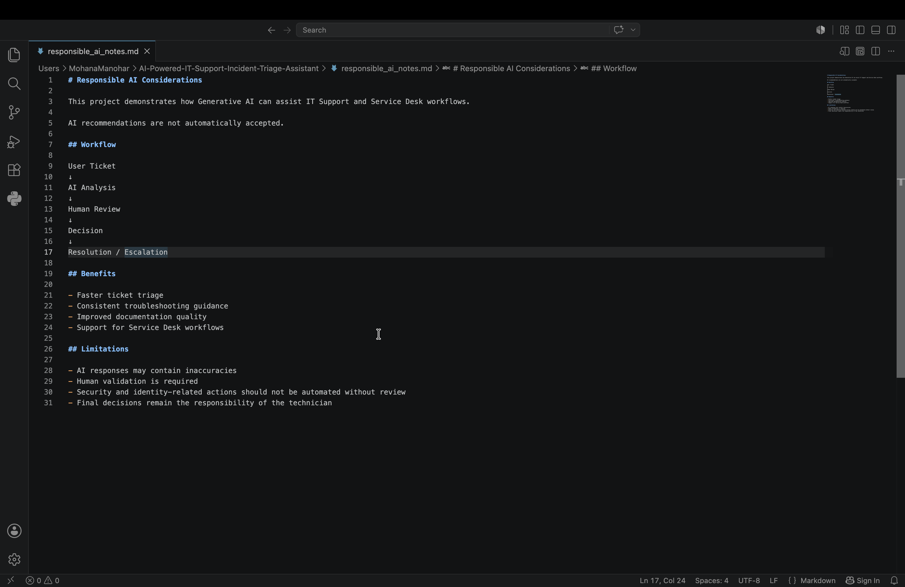

---

## What I Learned

Through this project I gained practical experience with:

- Integrating Generative AI into a Python workflow
- Working with the Gemini API
- Prompt design and refinement
- Generating structured AI outputs
- Testing AI responses against realistic scenarios
- Human-in-the-loop workflows
- Responsible AI principles
- Applying Generative AI to a practical IT Support use case

---

## Limitations

This is a small prototype and not a production IT Support system.

Current limitations include:

- Small fictional dataset
- No live Service Desk integration
- No access to real organisational systems
- AI outputs may be incorrect or incomplete
- Human validation is required before operational or security decisions
  
---

## Career Relevance

This project builds practical experience across:

- Generative AI
- Python
- API Integration
- Prompt Engineering
- IT Support Workflows
- Incident Management
- Responsible AI

It demonstrates how AI can be applied to a practical business problem while keeping human judgement, validation and responsible AI principles at the centre of the workflow.

---
