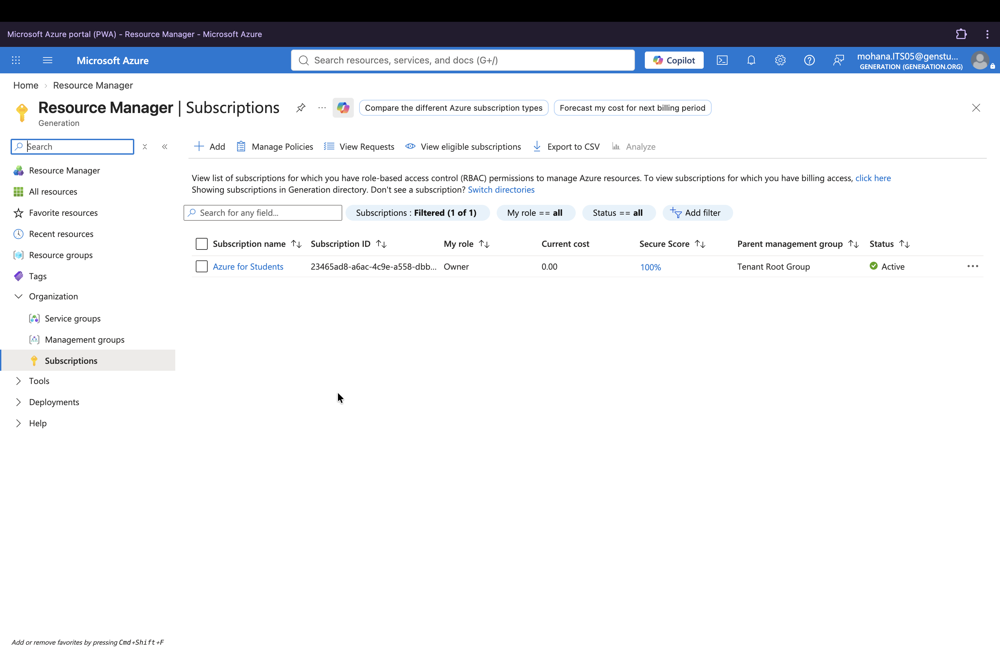
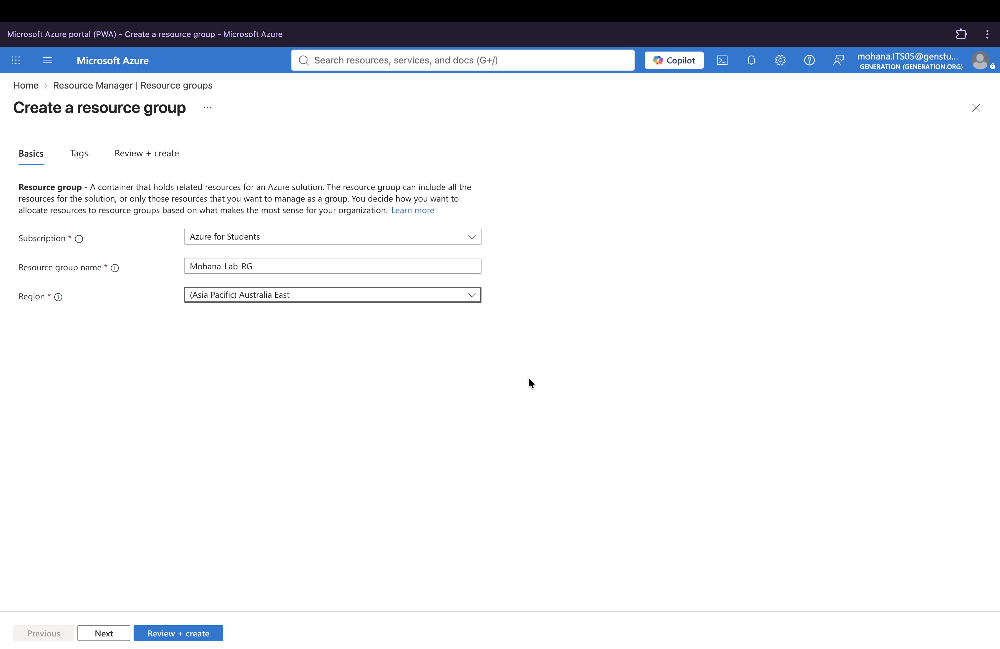
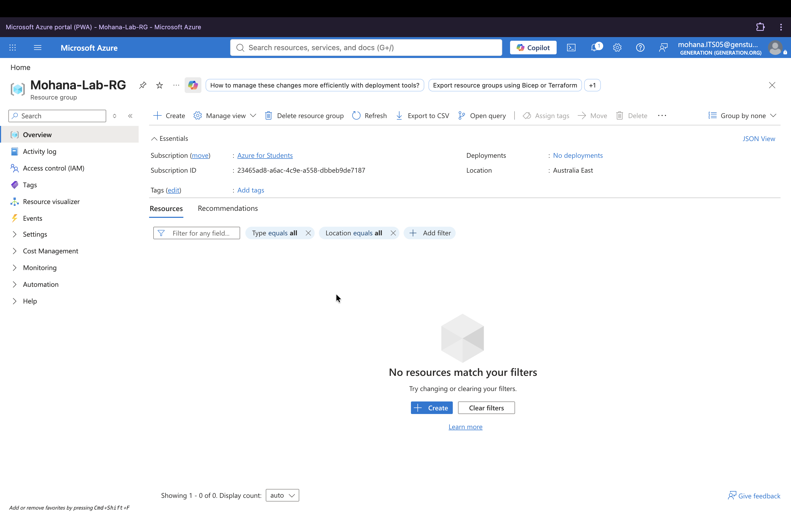
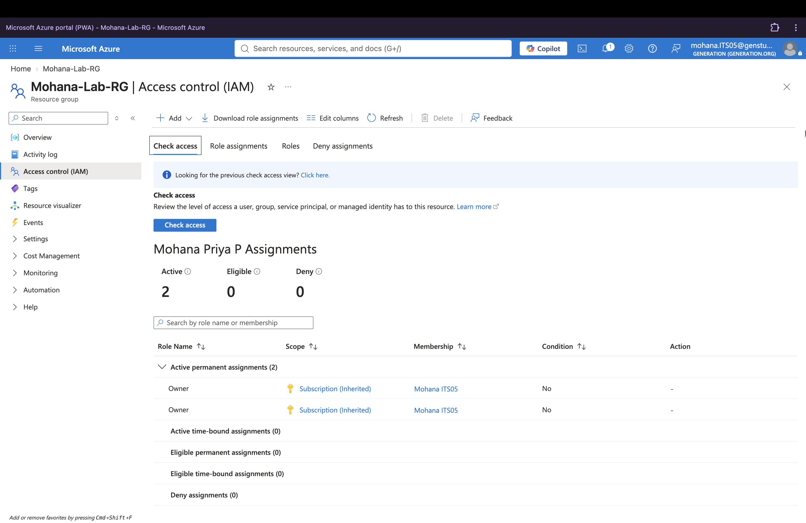
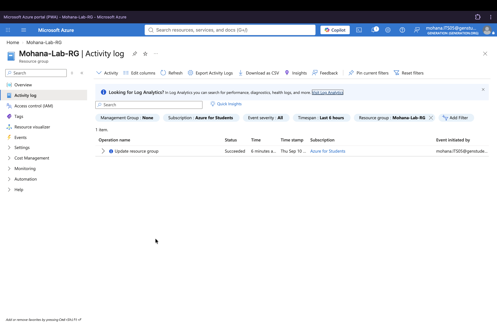
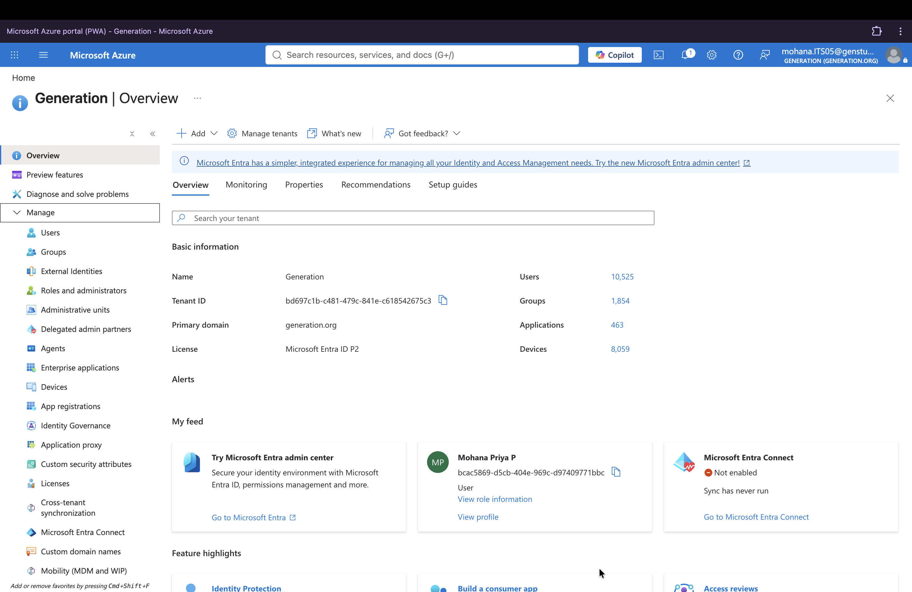
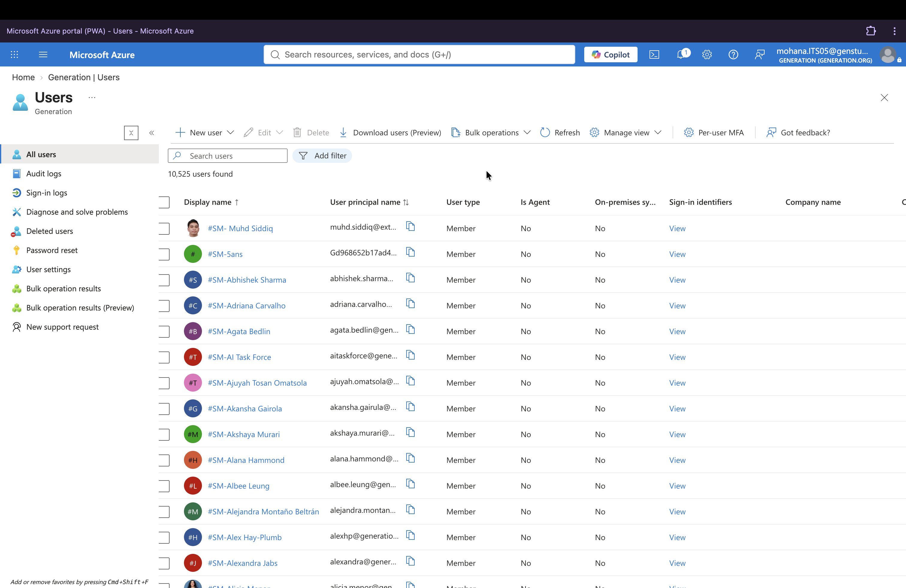
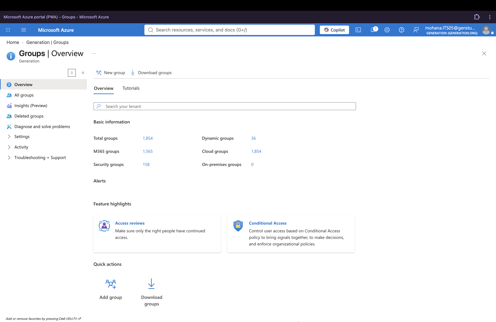
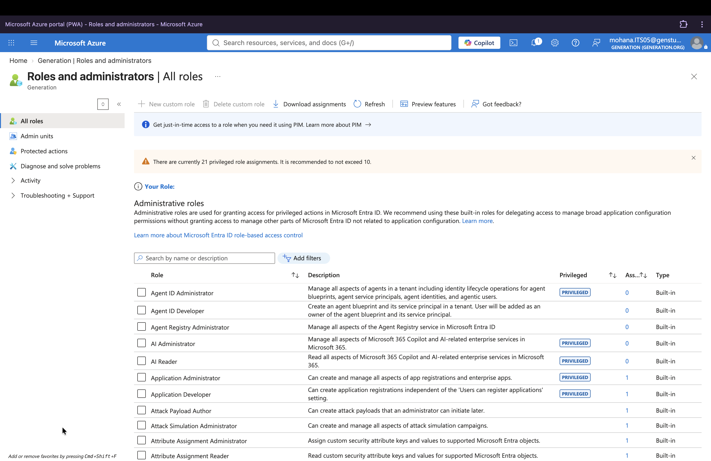

# Azure Fundamentals & Entra ID Administration Lab

## Project Status

✅ Completed

**Date:** September 2026

**Category:** Personal Home Lab

---

## Overview

This lab was completed using Microsoft Azure for Students and Microsoft Entra ID.

The objective was to develop practical hands-on understanding of Azure resource management, identity administration and cloud governance concepts relevant to IT Support, Systems Administration, Managed Services and Cloud environments.

The lab focused on creating and managing Azure Resource Groups, reviewing access control and activity logs, and exploring Microsoft Entra ID features including users, groups and administrative roles.

---

## Skills Practised

- Microsoft Azure Fundamentals
- Azure Resource Management
- Resource Group Management
- Identity & Access Management (IAM) Concepts
- Microsoft Entra ID
- Role-Based Access Control (RBAC)
- User Administration
- Group Administration
- Activity Log Review
- Cloud Governance Concepts
- Technical Documentation

---

## Lab Environment

| Item | Details |
|--------|--------|
| Platform | Microsoft Azure |
| Subscription | Azure for Students |
| Identity Platform | Microsoft Entra ID |
| Lab Type | Personal Home Lab |

---

## Activities Completed

### 1. Review Azure Subscription

#### Learning Outcome

Reviewed the Azure subscription configuration and explored available subscription and access information.

---

### 2. Create Resource Group

#### Learning Outcome

Created an Azure Resource Group to practise organising and managing cloud resources within Azure Resource Manager.

---

### 3. Verify Resource Group Creation

#### Learning Outcome

Verified the newly created Resource Group and reviewed its configuration within Azure Resource Manager.

---

### 4. Review Access Control (IAM)

#### Learning Outcome

Reviewed Azure Role-Based Access Control (RBAC) and explored how permissions and assigned roles are used to control access to Azure resources.

---

### 5. Review Activity Logs

#### Learning Outcome

Reviewed Azure Activity Logs to understand how administrative actions and resource management events are recorded for monitoring and auditing.

---

### 6. Explore Microsoft Entra ID

#### Learning Outcome

Explored Microsoft Entra ID and reviewed identity management capabilities within the cloud environment.

---

### 7. Review User Administration

#### Learning Outcome

Explored Entra ID user administration features, including account management, password-related options and available audit information.

---

### 8. Review Group Administration

#### Learning Outcome

Explored group management capabilities, including Microsoft 365 Groups, Security Groups and Dynamic Groups.

---

### 9. Review Administrative Roles

#### Learning Outcome

Explored Microsoft Entra administrative roles and reviewed how role-based access concepts are used to manage privileged access.

---

## Azure Services Explored

| Service | Purpose |
|----------|----------|
| Azure Resource Groups | Resource Organisation |
| Azure Activity Logs | Administrative Monitoring & Auditing |
| Access Control (IAM) | Permissions Management |
| Microsoft Entra ID | Identity Management |
| Users | Account Management |
| Groups | Group-Based Access Control |
| Administrative Roles | Role-Based Access Management |

---

## Security Concepts Practised

- Identity & Access Management (IAM)
- Role-Based Access Control (RBAC)
- Least Privilege Concepts
- Access Review
- User Lifecycle Management
- Privileged Access Management Concepts
- Cloud Governance
- Audit Logging
- Security Monitoring Concepts

---

## Key Takeaways

This lab provided hands-on practice with Microsoft Azure and Microsoft Entra ID in a controlled learning environment.

By creating Resource Groups, reviewing access control permissions, analysing Activity Logs and exploring Entra ID administration features, I strengthened my understanding of cloud resource management, identity administration and access control concepts.

The project also reinforced how permissions, user and group management, administrative roles and audit logging contribute to secure and well-governed cloud environments.

---

## Relevance to IT Support & Cloud Administration

This lab reflects foundational activities relevant to:

- IT Support
- Managed Services
- Cloud Administration
- Identity Administration
- Systems Administration
- Cybersecurity

Activities included:

- Azure Resource Management
- Access Control Reviews
- User Administration
- Group Management
- Administrative Role Review
- Activity Log Review
- Identity Management

---

## Career Relevance

This lab strengthened practical skills commonly used in entry-level IT Support, Managed Services and Systems Administration roles, including cloud resource management, identity administration, access control and audit log review.

The project also provided exposure to Microsoft technologies frequently referenced in modern IT environments, including Azure, Microsoft Entra ID, Role-Based Access Control (RBAC) and cloud governance concepts.

---

## Key Learning

This project helped bridge cloud concepts previously learned through training with practical hands-on administration activities using Microsoft Azure and Microsoft Entra ID.

It strengthened my understanding of how Azure manages resources and how Microsoft Entra ID supports identity, access and administrative control within cloud environments.

---
