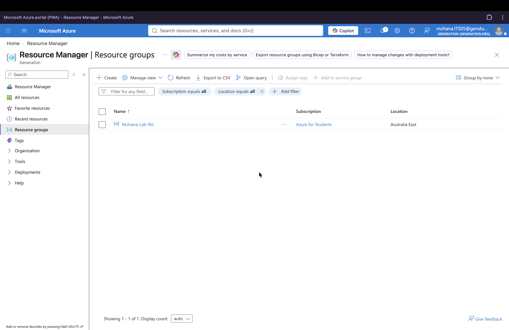
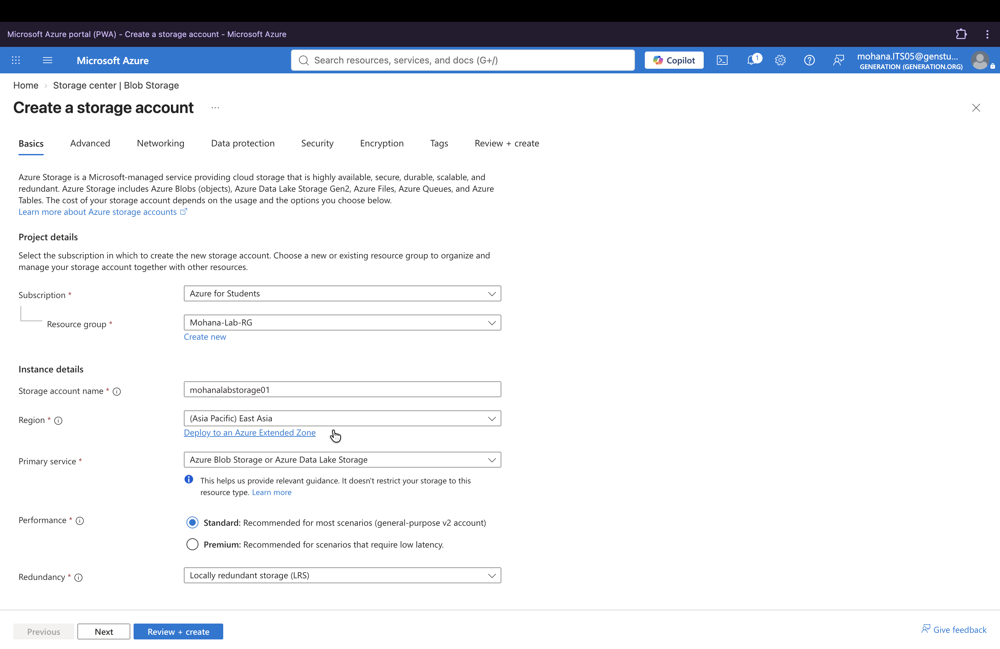
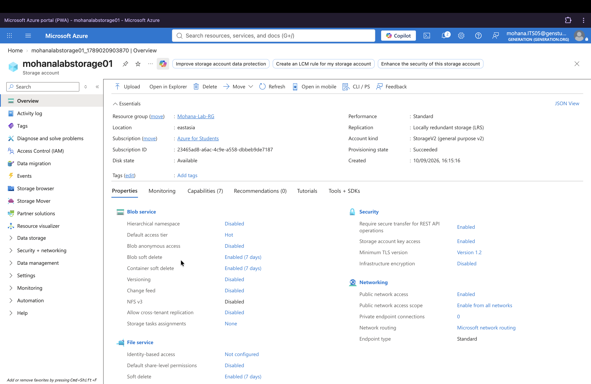
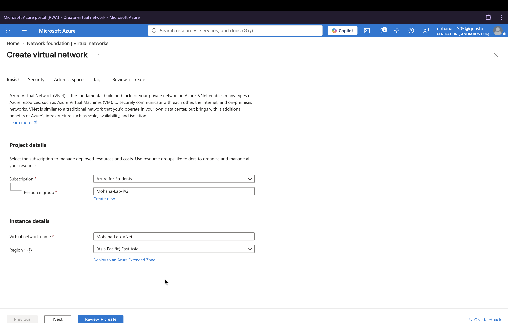
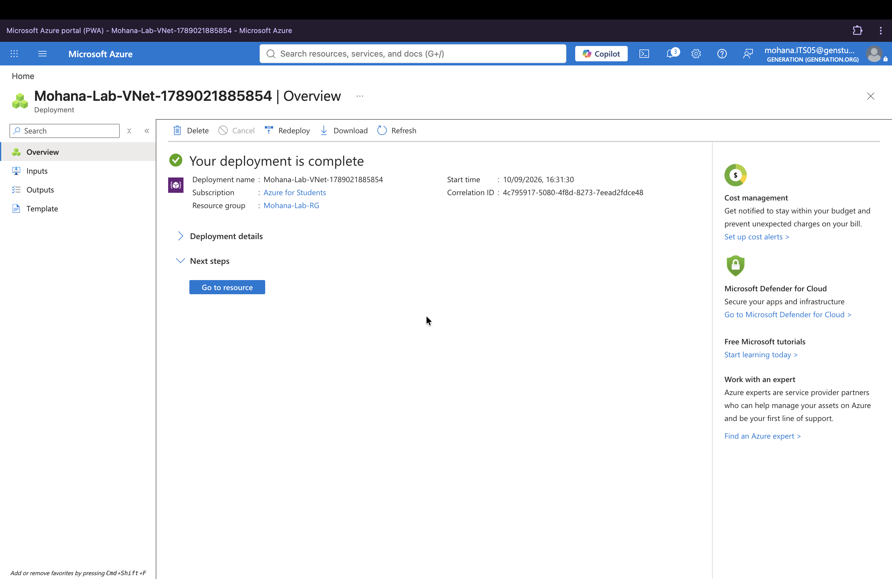
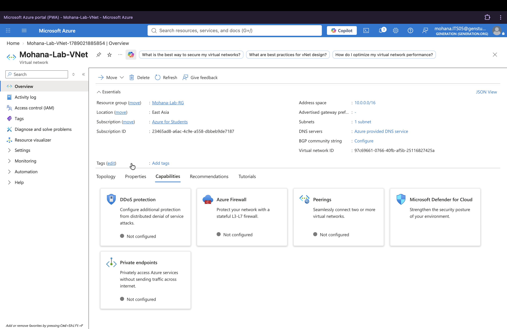
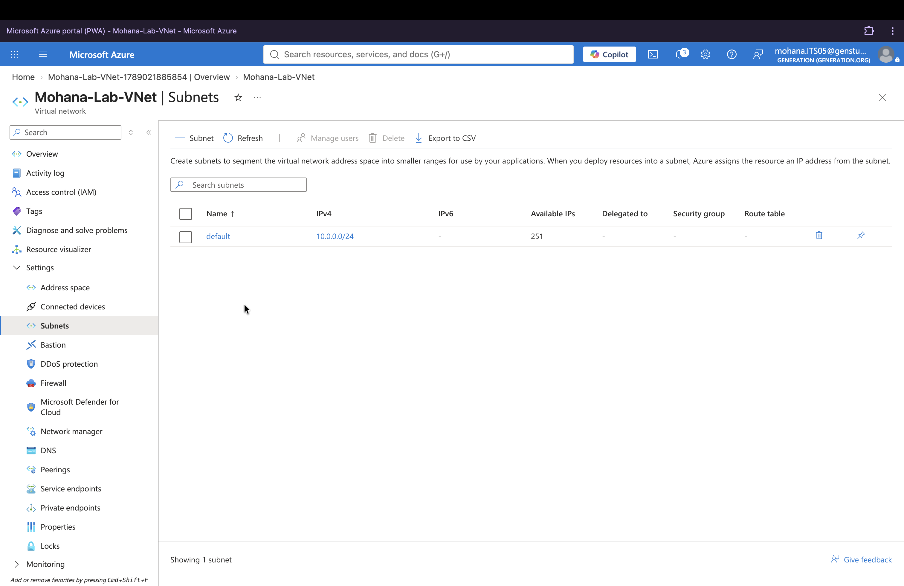
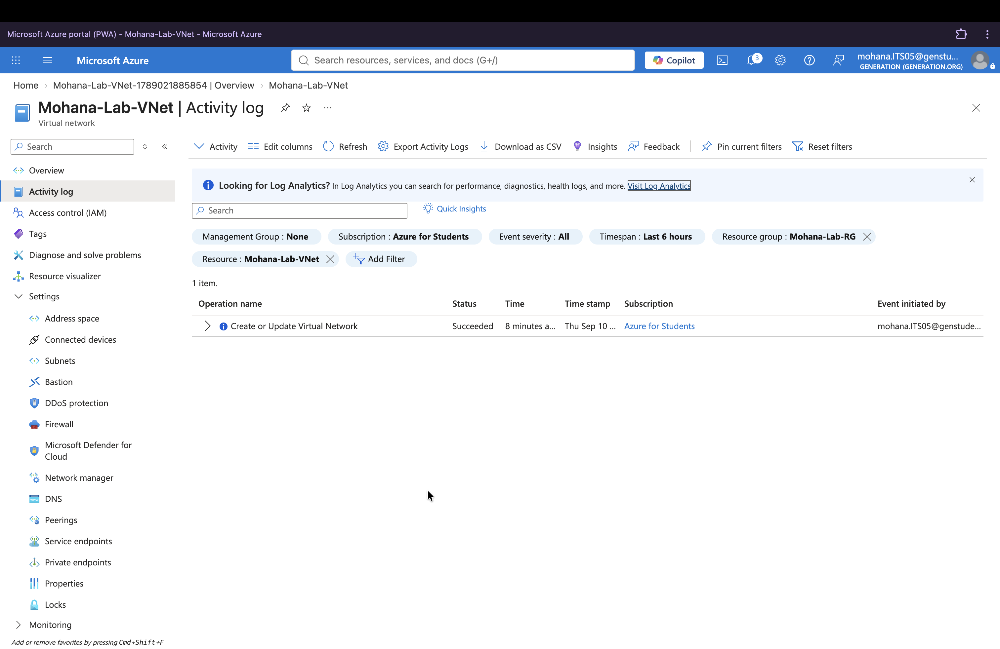

# Azure Storage & Virtual Networking Lab

## Project Status

✅ Completed

**Date:** September 2026

**Category:** Personal Home Lab

---

## Overview

This lab was completed using Microsoft Azure for Students.

The objective was to develop practical hands-on understanding of Azure cloud infrastructure components, including storage services, virtual networking, resource management and monitoring concepts relevant to IT Support, Managed Services, Systems Administration and Cloud environments.

The lab focused on creating and reviewing Azure Storage Accounts, Virtual Networks (VNets), Subnets and Azure Activity Logs to strengthen understanding of cloud infrastructure configuration and monitoring.

---

## Skills Practised

- Microsoft Azure Fundamentals
- Azure Resource Management
- Azure Storage Accounts
- Cloud Storage Concepts
- Azure Virtual Networks (VNets)
- Subnet Configuration
- Cloud Networking Concepts
- Resource Governance Concepts
- Activity Log Review
- Infrastructure Monitoring Concepts
- Technical Documentation

---

## Lab Environment

| Item | Details |
|--------|--------|
| Platform | Microsoft Azure |
| Subscription | Azure for Students |
| Services Used | Azure Storage Accounts, Azure Virtual Networks |
| Lab Type | Personal Home Lab |

---

## Activities Completed

### 1. Review Resource Groups

#### Learning Outcome

Reviewed Azure Resource Groups and explored how cloud resources can be organised and managed within Azure Resource Manager.

---

### 2. Create Storage Account

#### Learning Outcome

Created an Azure Storage Account and explored configuration options including storage performance and redundancy.

---

### 3. Verify Storage Account Creation

#### Learning Outcome

Verified the newly created Storage Account and reviewed the deployment process within Microsoft Azure.

---

### 4. Review Storage Account Configuration

#### Learning Outcome

Explored Storage Account configuration, including replication, networking, performance and security-related settings.

---

### 5. Create Virtual Network

#### Learning Outcome

Created an Azure Virtual Network (VNet) to practise cloud networking fundamentals and understand how virtual networks provide network segmentation within Azure.

---

### 6. Verify Virtual Network Deployment

#### Learning Outcome

Verified the newly created Virtual Network and reviewed its deployment details.

---

### 7. Review Virtual Network Configuration

#### Learning Outcome

Reviewed Virtual Network configuration, including address space, subnet allocation and DNS-related settings.

---

### 8. Review Subnet Configuration

#### Learning Outcome

Reviewed subnet configuration and explored how address ranges can be segmented within a Virtual Network.

---

### 9. Review Activity Logs

#### Learning Outcome

Reviewed Azure Activity Logs to understand how administrative actions, deployments and resource management operations are recorded for monitoring and auditing.

---

## Azure Services Explored

| Service | Purpose |
|----------|----------|
| Azure Resource Groups | Resource Organisation |
| Azure Storage Accounts | Cloud Storage |
| Azure Virtual Networks | Cloud Networking |
| Azure Subnets | Network Segmentation |
| Azure Activity Logs | Administrative Monitoring & Auditing |
| Azure Resource Manager | Resource Deployment & Management

---

## Cloud Concepts Practised

- Cloud Resource Management
- Azure Storage
- Virtual Networking
- Address Space Configuration
- Subnetting Concepts
- Cloud Infrastructure Configuration
- Resource Governance
- Infrastructure Monitoring
- Audit Logging

---

## Key Takeaways

This lab provided hands-on practice with core Azure infrastructure services within a controlled learning environment.

By creating and reviewing Storage Accounts, Virtual Networks and Subnets, I strengthened my understanding of how cloud storage and networking resources are configured and organised within Microsoft Azure.

The project also reinforced the importance of resource organisation, network segmentation, infrastructure monitoring and administrative auditing within cloud environments.

---

## Relevance to IT Support & Cloud Administration

This lab reflects foundational concepts relevant to:

- IT Support
- Managed Services
- Cloud Administration
- Systems Administration
- Infrastructure Support
- Cybersecurity

Activities included:

- Azure Resource Management
- Storage Configuration
- Virtual Network Configuration
- Subnet Configuration
- Activity Log Review
- Infrastructure Monitoring
- Cloud Resource Governance

---

## Key Learning

This project helped connect cloud infrastructure concepts with hands-on activities in Microsoft Azure.

It strengthened my understanding of how Azure Storage Accounts, Virtual Networks and Subnets are configured and how Azure Activity Logs provide visibility into administrative and resource management activity.

---

## Technologies Used

- Microsoft Azure
- Azure Resource Manager (ARM)
- Azure Storage Accounts
- Azure Virtual Networks (VNet)
- Azure Subnets
- Azure Activity Logs
