# Jira Service Management & ITSM Lab

## Project Status

✅ Completed

**Date:** September 2026  
**Category:** Personal Home Lab

---

## Overview

This personal home lab was completed using **Jira Service Management** to develop practical understanding of **IT Service Management (ITSM), incident management, service requests, ticket lifecycle management and Service Desk operations**.

The lab simulated common IT Support scenarios while practising ticket creation, categorisation, prioritisation, troubleshooting documentation, escalation concepts and workflow management commonly used in IT Support, Managed Services and IT Operations environments.

---

## Skills Practised

- IT Service Management (ITSM)
- Incident Management
- Service Request Management
- Ticket Lifecycle Management
- Ticket Prioritisation
- Troubleshooting Documentation
- Service Desk Operations
- Escalation Concepts
- Queue Management
- SLA Awareness
- Knowledge Management Concepts
- Technical Documentation

---

## Lab Environment

| Item | Details |
|---|---|
| Platform | Jira Service Management |
| Project Name | Mohana IT Support Lab |
| Project Key | ITSL |
| Lab Type | Personal Home Lab |

---

## Activities Completed

### 1. Jira Service Management Dashboard

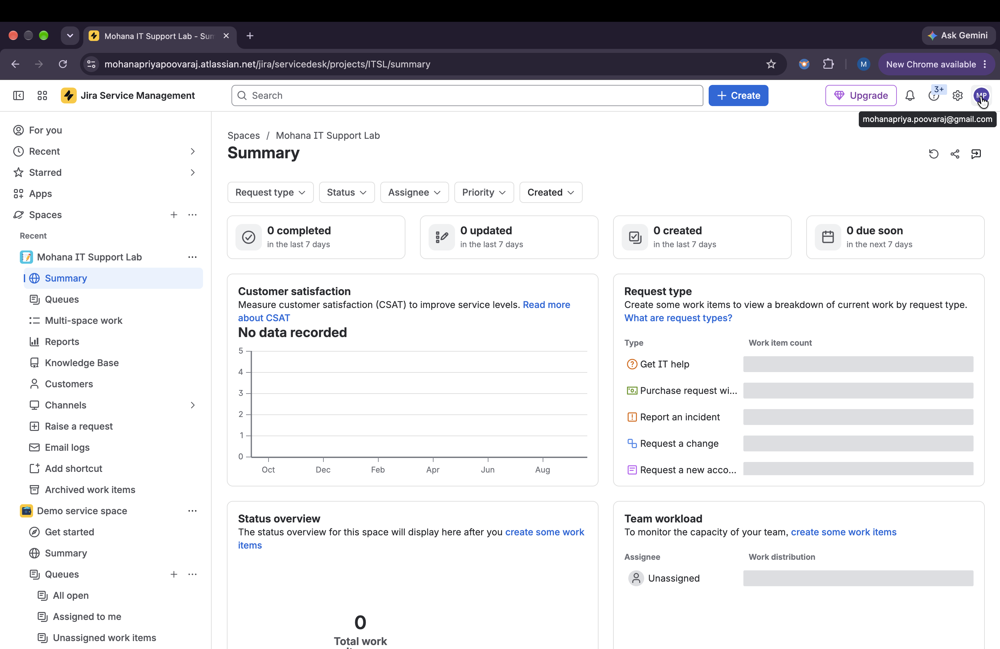

**Learning Outcome**

Created an IT Service Management project and explored Service Desk queues, reporting and ticket management functionality.

---

### 2. Create Incident – Microsoft Teams Login Failure

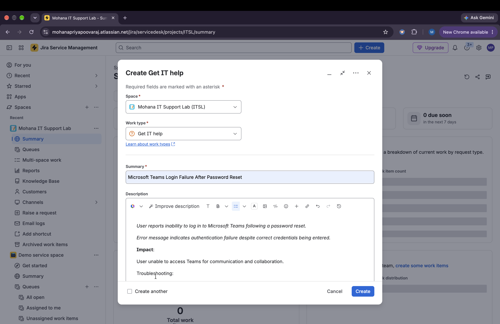

**Learning Outcome**

Created an incident ticket documenting an authentication issue affecting a Microsoft Teams user after a password reset.

---

### 3. Review Incident Ticket

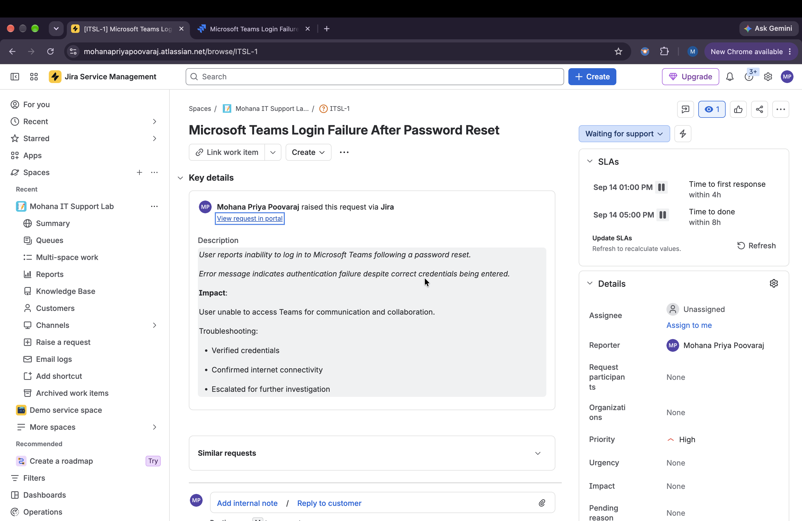

**Learning Outcome**

Reviewed ticket status, SLA information, priority assignment and troubleshooting documentation.

---

### 4. Create Incident – VPN Connectivity Issue

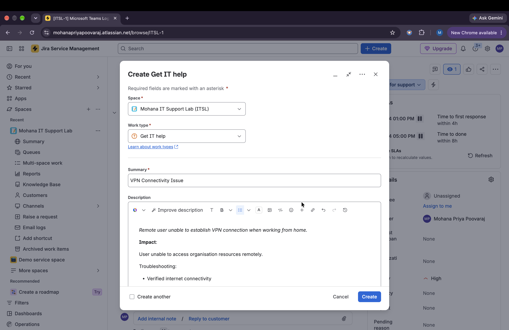

**Learning Outcome**

Created an incident ticket documenting a remote user's inability to establish a VPN connection and access organisational resources.

---

### 5. Review VPN Ticket

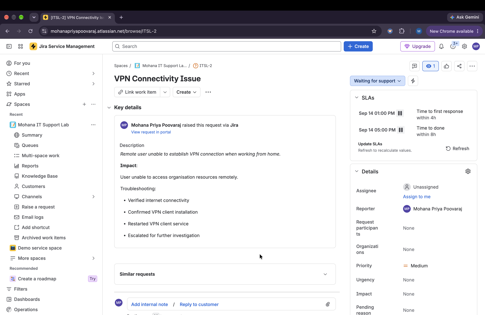

**Learning Outcome**

Reviewed incident lifecycle concepts including troubleshooting actions, escalation pathways and ticket tracking.

---

### 6. Create Service Request – New User Account

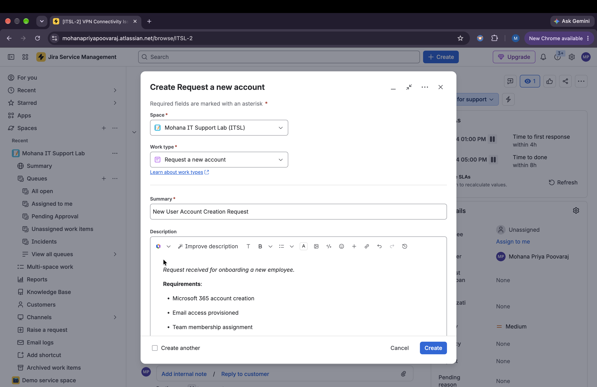

**Learning Outcome**

Created a service request representing onboarding activities including Microsoft 365 account creation, email access and permission assignment.

---

### 7. Review User Onboarding Request

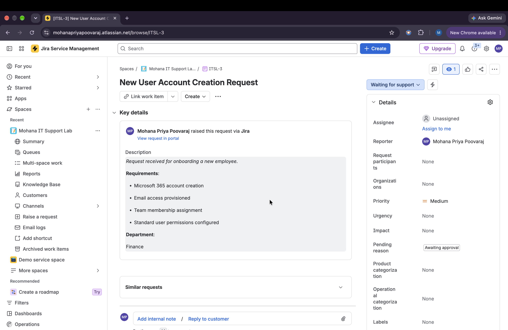

**Learning Outcome**

Reviewed approval-based request workflows and user provisioning concepts.

---

### 8. Create Service Request – Software Installation

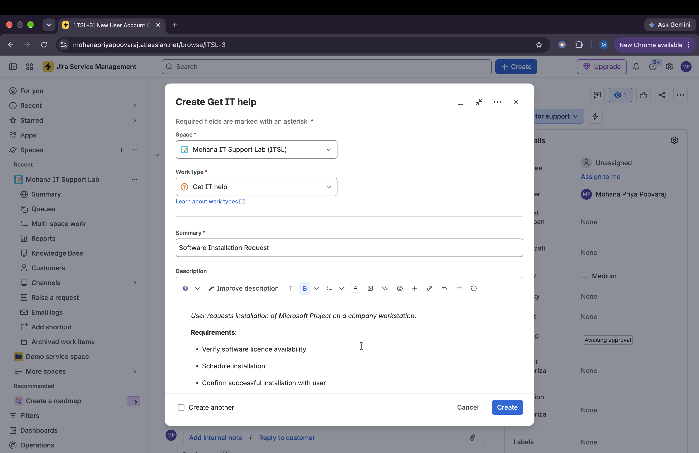

**Learning Outcome**

Created a service request for software deployment, licence verification and installation scheduling.

---

### 9. Review Software Installation Request

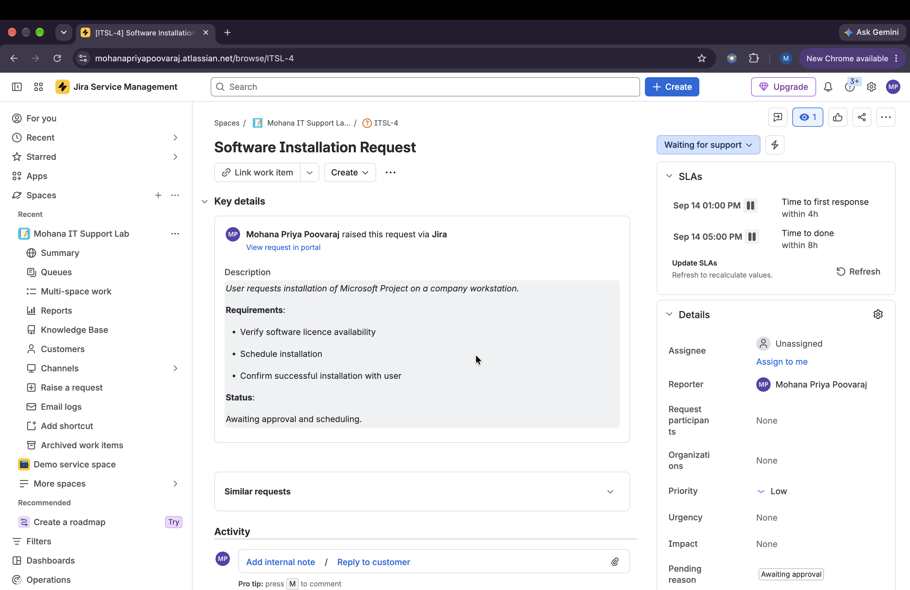

**Learning Outcome**

Reviewed service request workflows, approval processes and request lifecycle concepts.

---

### 10. Create Incident – Network Printer Offline

**Learning Outcome**

Created an incident documenting a shared network printer outage affecting multiple users.

---

### 11. Review Printer Incident Ticket

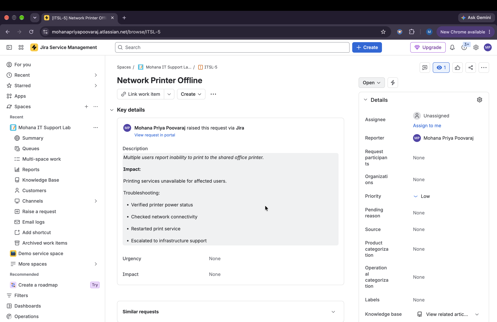

**Learning Outcome**

Reviewed troubleshooting documentation, escalation concepts and incident tracking functionality.

---

### 12. Review Queue Management

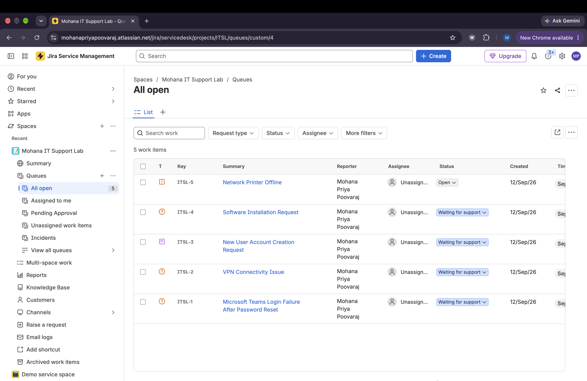

**Learning Outcome**

Reviewed multiple active incidents and service requests while exploring queue management concepts used by Service Desk teams.

---

## ITSM Concepts Practised

### Incident Management

Incidents represent unplanned interruptions to services requiring investigation and resolution.

**Simulated incidents:**

- Microsoft Teams Login Failure
- VPN Connectivity Issue
- Network Printer Offline

### Service Requests

Service requests represent planned requests for assistance, access or resources.

**Simulated service requests:**

- New User Account Creation
- Software Installation

### Ticket Lifecycle

The lab provided practical exposure to:

- Ticket creation
- Categorisation
- Priority assignment
- Troubleshooting documentation
- Escalation concepts
- SLA awareness
- Queue management
- Request workflows
- Incident tracking

---

## ITIL-Aligned Service Management Concepts

The lab reinforced foundational service management concepts commonly associated with ITIL-aligned Service Desk practices, including:

- Incident Management
- Service Request Management
- Prioritisation
- Escalation Procedures
- Service Delivery Concepts
- Ticket Documentation
- Queue Management
- SLA Awareness
- User Support Processes

> **Note:** This project provided practical exposure to ITSM processes and ITIL-aligned concepts; it was not an ITIL certification or formal ITIL implementation.

---

## Key Takeaways

This lab provided hands-on exposure to Jira Service Management and structured Service Desk workflows in a controlled environment.

By creating and reviewing simulated incidents and service requests, I strengthened my understanding of ticket lifecycle management, prioritisation, documentation, escalation and queue management.

The project also reinforced the distinction between **incidents** and **service requests** and the importance of clear documentation and structured issue tracking in IT Support environments.

---

## Relevance to IT Support & Service Desk Roles

This lab reflects foundational activities relevant to:

- IT Support
- Service Desk
- Managed Services
- IT Operations
- Technical Support

The practical scenarios focused on:

- Incident Management
- Service Request Management
- Ticket Tracking
- Troubleshooting Documentation
- Queue Management
- User Support Processes

---

## Technologies & Concepts Used

- Jira Service Management
- IT Service Management (ITSM)
- Incident Management
- Service Request Management
- Ticket Lifecycle Management
- ITIL-Aligned Service Management Concepts
- Queue Management
- SLA Concepts
- Technical Documentation
