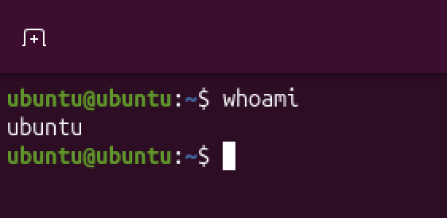

# Linux User Administration Lab

## Overview

This lab was completed using Ubuntu running in UTM on macOS.

The objective was to gain practical experience with Linux user administration tasks commonly performed in IT Support, Service Desk and Cybersecurity environments.

The lab focused on the complete user account lifecycle, including:

- User creation
- Password management
- User verification
- Account locking
- Account unlocking
- User deletion

---

## Skills Demonstrated

- Linux Administration
- User Account Management
- Password Administration
- Identity and Access Management (IAM)
- Access Control
- Linux Command Line
- Technical Documentation

---

## Lab Environment

| Item | Details |
|--------|--------|
| Host Device | MacBook |
| Platform | UTM |
| Operating System | Ubuntu Linux |
| Lab Type | Personal Home Lab |

---

## Activities Completed

### 1. Verified Current User

**Command**

```bash
whoami
```

**Screenshot:** 

---

### 2. Created New User Account

**Command**

```bash
sudo adduser testuser
```

**Screenshot:** 


---

### 3. Verified User Creation

**Command**

```bash
cat /etc/passwd | grep testuser
```

**Screenshot:** 

---

## Key Takeaways

This lab provided practical experience managing user accounts within a Linux environment.

Through this exercise, I practised creating, verifying, securing and removing user accounts using Linux command-line tools while developing foundational system administration and access management skills.

---

## Next Steps

Future labs will include:

- Linux File Permissions & Ownership
- Linux Group Administration
- Network Troubleshooting
- Windows User Administration
- Event Log Analysis
- Phishing Investigation Projects
