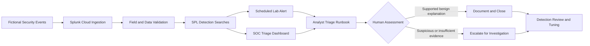

# Splunk Detection Engineering & SOC Alert Triage Lab

## Project Status

✅ Completed

**Date:** September 2026  
**Category:** Cyber Security, Security Operations, SIEM, Detection Engineering  
**Environment:** Splunk Cloud Platform Trial  
**Data classification:** Fictional laboratory data only

---

## Overview

This project extends my earlier **Splunk Security Monitoring and Log Analysis Lab**.

The first phase focused on foundational Splunk activities, including:

- Security-log ingestion
- Custom source-type configuration
- Event searching and filtering
- Authentication and VPN monitoring
- Dashboard development

This second phase develops those foundations into a structured detection and SOC alert-triage workflow.

The project demonstrates practical exposure to:

- Detection use-case design
- Splunk Search Processing Language
- Scheduled lab-alert configuration
- Authentication and VPN investigations
- Privileged-access monitoring
- Event correlation
- SOC dashboard development
- Analyst triage procedures
- False-positive analysis
- Detection validation and tuning
- MITRE ATT&CK mapping
- Human review and evidence-based decision-making

---

## Project Objective

The objective was to design, test and document lab-based Splunk detections for authentication, remote-access and privileged-account activity.

The project follows this workflow:

```text
Fictional Security Events
          ↓
Splunk Cloud Ingestion
          ↓
Field and Data Validation
          ↓
SPL Detection Searches
          ↓
Scheduled Lab Alert
          ↓
SOC Triage Dashboard
          ↓
Analyst Investigation
          ↓
Document and Close or Escalate
          ↓
Detection Review and Tuning
```

---

## Architecture



The standalone workflow document is available at:

architecture/detection-workflow.md

---

## Lab Disclaimer

This project was completed in a personal Splunk Cloud trial using fictional security events.

The detection thresholds are illustrative and are not production-ready. Searches were created to demonstrate detection logic, investigation methods and analyst decision-making in a controlled learning environment.

A detection result is an investigation lead. It does not independently confirm malicious activity.

All results require human validation before escalation or closure.

---

## Technologies and Concepts

- Splunk Cloud Platform
- Splunk Search Processing Language
- Splunk Search and Reporting
- Splunk Dashboard Studio
- Scheduled alerts
- CSV data ingestion
- Custom source types
- Structured field validation
- Authentication monitoring
- VPN activity monitoring
- Privileged-access monitoring
- Detection engineering concepts
- SOC alert triage
- Event correlation
- False-positive analysis
- Detection tuning
- MITRE ATT&CK
- Python
- Markdown
- Git and GitHub
---

## Dataset

A fictional dataset containing **49 structured security events** was created specifically for this project.

The dataset was generated using:

```text
create_detection_dataset.py
```

The resulting CSV is stored at:

```text
dataset/sample_security_detection_events.csv
```

### Dataset fields

| Field | Description |
|---|---|
| `timestamp` | Date and time of the event |
| `event_type` | Category of recorded activity |
| `outcome` | Result of the activity |
| `user` | Fictional user account |
| `src_ip` | Fictional source IP address |
| `device` | Fictional device identifier |
| `location` | Fictional source location |
| `details` | Additional event information |

### Included scenarios

- Normal successful logins
- Repeated authentication failures
- Successful authentication after repeated failures
- One source targeting multiple accounts
- Normal VPN activity
- VPN access from an unknown device and location
- Approved and review-required software installations
- Password-reset activity
- Privileged-group membership changes

No real customer, employee or organisational data was used.

The source addresses use documentation-only IP ranges:

```text
192.0.2.0/24
198.51.100.0/24
203.0.113.0/24
```

The detailed field definition is available at:

dataset/data_dictionary.md

### Dataset generation evidence

screenshots/01-fictional-dataset-created.png

---

## Data Ingestion

The fictional CSV dataset was uploaded to Splunk Cloud using:

```text
Index: main
Source type: security_detection_lab
Host: detection-lab
```

The custom source type separated the Phase 2 dataset from the original Phase 1 source type:

```text
security_log_lab
```

Splunk successfully ingested all **49 fictional events**.

### Ingestion evidence

screenshots/02-data-ingestion-preview.png

screenshots/04-data-ingestion-review.png

screenshots/06-ingestion-count-validation.png

---

## Field and Data Validation

Before creating detections, the data was checked to confirm that all required fields were present and populated.

Validated fields included:

- `event_type`
- `outcome`
- `user`
- `src_ip`
- `device`
- `location`
- `details`

The validation confirmed:

- 49 ingested events
- 4 event types
- 4 outcome values
- 11 fictional source IP addresses
- 6 fictional user accounts

### Validation evidence

screenshots/07-structured-field-validation.png

screenshots/08-field-summary.png

screenshots/09-event-value-validation.png

---

## Detection Summary

Five detection use cases and one correlation query were developed.

| Detection | Security focus | Test result |
|---|---|---:|
| Repeated Authentication Failures | Authentication monitoring | Passed |
| Successful Login After Repeated Failures | Account-compromise investigation | Passed |
| Multiple Accounts Targeted From One Source | Password-spraying behaviour | Passed |
| VPN Activity Requiring Review | Remote-access monitoring | Passed |
| Privileged Group Change | Privileged-access monitoring | Passed |
| Admin Activity Timeline | Event correlation | Passed |

All SPL searches are stored in:

queries/detection_queries.spl

---

## Detection 1: Repeated Authentication Failures

This detection identifies at least five failed authentication attempts involving the same user and source IP within a ten-minute time bucket.

### Result

```text
User: admin
Source IP: 203.0.113.10
Failed attempts: 6
```

Possible explanations include:

- Incorrect password
- Recently changed credentials
- Cached credentials
- Misconfigured application or service
- Credential guessing
- Brute-force activity

screenshots/10-repeated-login-failures.png

Detailed detection documentation:

detections/01-repeated-login-failures.md

---

## Detection 2: Successful Login After Repeated Failures

This detection identifies a successful login after at least five failures involving the same user and source IP.

### Result

```text
User: admin
Source IP: 203.0.113.10
Device: UNKNOWN-DEVICE
Previous failures: 6
Outcome: success
```

This is a higher-priority investigation lead, but it does not independently prove account compromise.

screenshots/11-success-after-failures.png

Detailed detection documentation:

detections/02-success-after-failures.md

---

## Detection 3: Multiple Accounts Targeted From One Source

This detection identifies a source IP generating failed authentication attempts against several accounts.

### Result

```text
Source IP: 198.51.100.25
Unique users: 4
Failed attempts: 7
```

Affected fictional accounts:

- `analyst1`
- `finance01`
- `helpdesk`
- `mohana`

This pattern may be consistent with password spraying. Shared infrastructure, authorised testing and application misconfiguration must also be considered.

screenshots/12-multiple-accounts-one-source.png

Detailed detection documentation:

detections/03-multiple-accounts-one-source.md

---

## Detection 4: VPN Activity Requiring Review

This detection identifies successful VPN activity involving an unknown device or location.

### Result

```text
User: admin
Source IP: 203.0.113.75
Device: UNKNOWN-DEVICE
Location: Unknown
Outcome: success
```

The activity requires analyst review but is not automatically classified as malicious.

screenshots/13-vpn-activity-review.png

Detailed detection documentation:

detections/04-vpn-activity-review.md

---

## Detection 5: Privileged Group Change

This detection identifies account-change events referring to privileged-group membership.

### Result

```text
User: admin
Source IP: 203.0.113.10
Device: UNKNOWN-DEVICE
Outcome: success
Details: User added to privileged group
```

The change should be checked against an approved access or change request before closure.

screenshots/14-privileged-group-change.png

Detailed detection documentation:

detections/05-privileged-group-change.md

---

## Event Correlation

An investigation query reviewed all activity involving the fictional `admin` account.

The timeline linked:

1. Six failed authentication attempts
2. A successful login after the failures
3. A VPN connection from an unfamiliar source
4. A privileged-group membership change

Reviewing related activity provides stronger context than assessing each event separately.

screenshots/15-admin-activity-timeline.png

The sequence was treated as an investigation lead rather than automatic confirmation of compromise.

An analyst would:

1. Review the authentication timeline.
2. Validate the source IP and device context.
3. Check whether the VPN activity was expected.
4. Validate the privileged-access change against an approved request.
5. Review supporting and conflicting evidence.
6. Escalate if the activity could not be explained safely.

---

## Scheduled Lab Alert

A scheduled alert was created for repeated authentication failures.

### Configuration

```text
Alert name: LAB - Repeated Authentication Failures
Type: Scheduled
Schedule: Hourly
Trigger: Number of results greater than zero
Action: Add to Triggered Alerts
Permissions: Shared in App
```

The hourly schedule was used only for laboratory demonstration with static historical data.

A production implementation would require:

- A rolling search window
- Environment-specific thresholds
- Alert throttling or suppression
- Operational severity criteria
- Approved notification channels
- Documented response procedures

screenshots/16-repeated-failures-alert-configuration.png

screenshots/17-alert-created.png

screenshots/18-lab-alerts-list.png

---

## SOC Authentication Detection & Triage Dashboard

A Splunk Dashboard Studio dashboard was created to bring the detection results into one analyst view.

The dashboard includes:

1. Failed Logins Over Time
2. Failed Login Attempts by User
3. Failed Login Attempts by Source IP
4. Successful Login After Repeated Failures
5. Multiple Accounts Targeted From One Source
6. VPN Activity Requiring Review
7. Privileged Group Changes

The dashboard uses an **All time** range because the events form a static historical lab dataset.

### Dashboard evidence

screenshots/19-soc-triage-dashboard-part1.png

screenshots/20-soc-triage-dashboard-part2.png

screenshots/21-soc-triage-dashboard-part3.png

screenshots/22-soc-triage-dashboard-privileged-change.png

---

## Analyst Triage Runbook

An authentication-alert triage runbook was created to support consistent analyst review.

The runbook covers:

- Initial alert review
- Authentication-event pivots
- VPN and account-change review
- Possible benign explanations
- Evidence-recording requirements
- Escalation criteria
- Closure criteria
- Human-review requirements

View the runbook:

runbooks/authentication-alert-triage.md

---

## Detection Validation

Each query was executed against the fictional dataset and compared with the expected scenario.

| Detection | Test result | Human review required? |
|---|---:|---:|
| Repeated Login Failures | Passed | Yes |
| Success After Failures | Passed | Yes |
| Multiple Accounts Targeted | Passed | Yes |
| VPN Activity Review | Passed | Yes |
| Privileged Group Change | Passed | Yes |
| Admin Activity Timeline | Passed | Yes |

View the full validation report:

validation/detection-test-results.md

---

## False Positives and Detection Tuning

Potential benign explanations included:

- Forgotten or mistyped passwords
- Recently changed credentials
- Cached credentials
- Misconfigured applications or services
- Shared proxies
- Network Address Translation
- Central authentication gateways
- Approved remote work
- Approved privileged-access changes
- Authorised security testing

Potential tuning approaches included:

- Establishing behavioural baselines
- Applying rolling time windows
- Using separate thresholds for privileged accounts
- Correlating events with device and MFA context
- Connecting access changes to approved requests
- Applying verified allow lists
- Using suppression to reduce duplicate alerts

View the full tuning notes:

validation/false-positive-notes.md

---

## MITRE ATT&CK Mapping

| Detection | Investigative mapping |
|---|---|
| Repeated authentication failures | T1110, Brute Force |
| Multiple accounts targeted | T1110.003, Password Spraying |
| Successful login after failures | T1078, Valid Accounts, as investigation context |
| VPN activity requiring review | T1133, External Remote Services, as investigation context |
| Privileged-group change | T1098, Account Manipulation, as investigation context |

The mappings identify behaviours that the searches may help investigate. A matching result does not prove that the mapped technique occurred.

---

## Human Review and Responsible Use

The project uses the following decision path:

```text
Detection Result
        ↓
Analyst Review
        ↓
Evidence Collection
        ↓
Context Validation
        ↓
Document and Close or Escalate
        ↓
Detection Review and Tuning
```

Key principles:

- Detection results are investigation leads.
- Alerts do not automatically confirm malicious activity.
- Benign explanations must be considered.
- Access changes require approval validation.
- Escalation decisions require supporting evidence.
- Uncertainty should be documented.
- Detection logic requires continued review and tuning.

---

## Limitations

This project is a personal lab and not an enterprise security-monitoring implementation.

Current limitations include:

- Small fictional dataset
- Static historical data
- Illustrative thresholds
- No production telemetry
- No behavioural baseline
- No real identity, endpoint or network integrations
- No EDR or SOAR integration
- No production alert-notification channels
- No formal change or access-request system
- Limited alert-suppression testing
- No enterprise-scale performance testing

---

## Project Outcome

The project successfully developed and validated:

- Five lab-based Splunk detections
- One correlation investigation
- One scheduled laboratory alert
- One seven-panel SOC triage dashboard
- One analyst-triage runbook
- False-positive and tuning documentation
- Detection-validation evidence

All searches produced the intended results against the controlled fictional dataset.

---

## What I Learned

This project developed my practical understanding of:

- Detection-use-case design
- Structured security-data generation
- Splunk Cloud ingestion
- Custom source types
- Field and data validation
- SPL detection logic
- Scheduled alerts
- SOC dashboard creation
- Event correlation
- False-positive analysis
- Investigation pivots
- Escalation and closure criteria
- MITRE ATT&CK mapping
- Detection limitations
- Human review in security decisions

The central learning was that an effective detection is more than an SPL query. It requires appropriate data, tested logic, analyst context, false-positive awareness, clear documentation, human judgement and continued tuning.

---

## Relationship to Phase 1

This project builds on my earlier:

```text
Splunk Security Monitoring & Log Analysis Lab
```

The progression is:

```text
Phase 1
├── Data ingestion
├── Source-type configuration
├── Security searches
├── Authentication monitoring
├── VPN review
└── Monitoring dashboard
        ↓
Phase 2
├── Structured detection data
├── Correlation searches
├── Scheduled alerts
├── SOC triage dashboard
├── Analyst runbook
├── Detection validation
├── False-positive analysis
└── Tuning considerations
```

---

## Career Relevance

This project provides lab-based exposure relevant to early-career roles involving:

- Security Operations
- SOC Analysis
- SIEM Monitoring
- Detection Engineering
- Incident Response
- IT Operations
- Identity Monitoring
- Cloud and Infrastructure Security
- Technical Support with security responsibilities

All work was completed in a controlled personal lab with fictional data and should not be interpreted as production SOC experience.
