# Windows User Administration Lab

## Project Status

✅ Completed

**Date:** September 2026

**Category:** Home Lab

---

## Overview

This lab was completed in a Windows 11 virtual machine running in UTM on macOS.

The objective was to gain practical experience with common user administration tasks relevant to IT Support, Service Desk and Systems Administration environments.

The lab focused on user account lifecycle management, password administration, group membership and access control concepts within a Windows environment.

---

## Skills Practised

- Windows User Administration
- User Account Management
- Password Administration
- Access Control
- Group Membership Management
- Identity & Access Management (IAM) Concepts
- User Lifecycle Management
- Service Desk Support Concepts
- Technical Documentation

---

## Lab Environment

| Item | Details |
|--------|--------|
| Host Device | MacBook |
| Platform | UTM |
| Operating System | Windows 11 |
| Lab Type | Personal Home Lab |

---

## Activities Completed

### 1. Open Computer Management

**Screenshot**

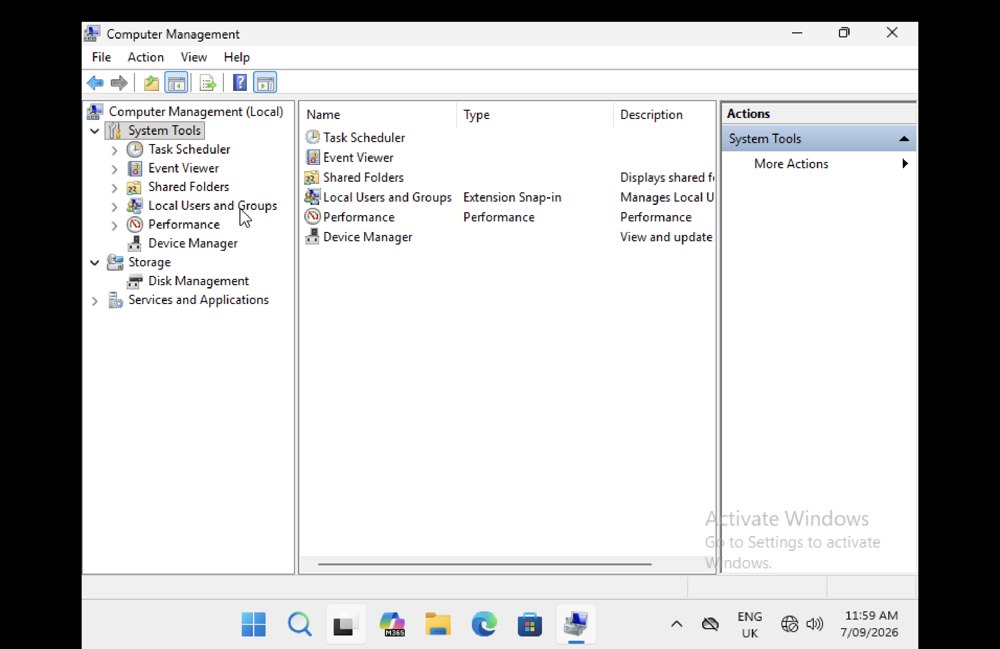

### Learning Outcome

Accessed Windows administrative tools used to manage local users, groups and system resources.

---

### 2. View Local User Accounts

**Screenshot**

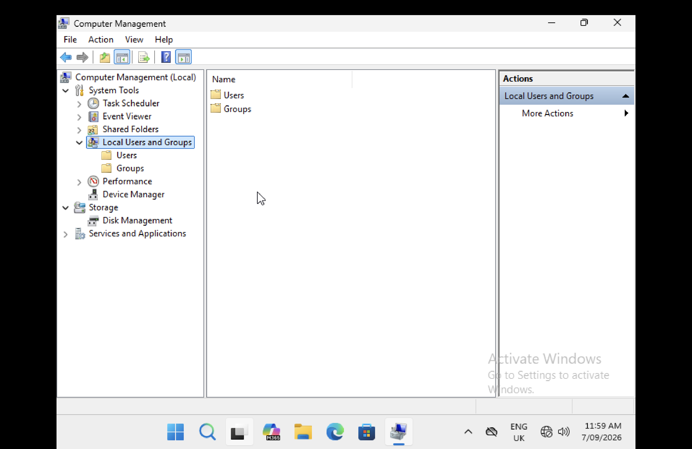

### Learning Outcome

Reviewed existing local user accounts and explored Windows user management capabilities.

---

### 3. Create User Account

**Screenshot**

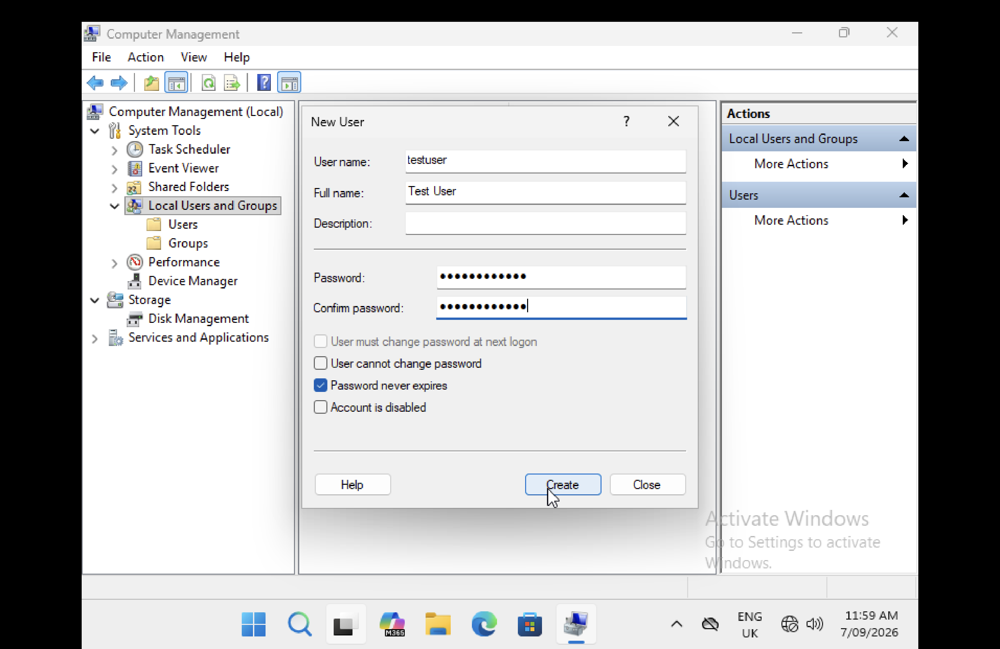

### Learning Outcome

Created a new local user account to simulate user onboarding activities commonly performed by Service Desk teams.

---

### 4. Verify User Account

**Screenshot**

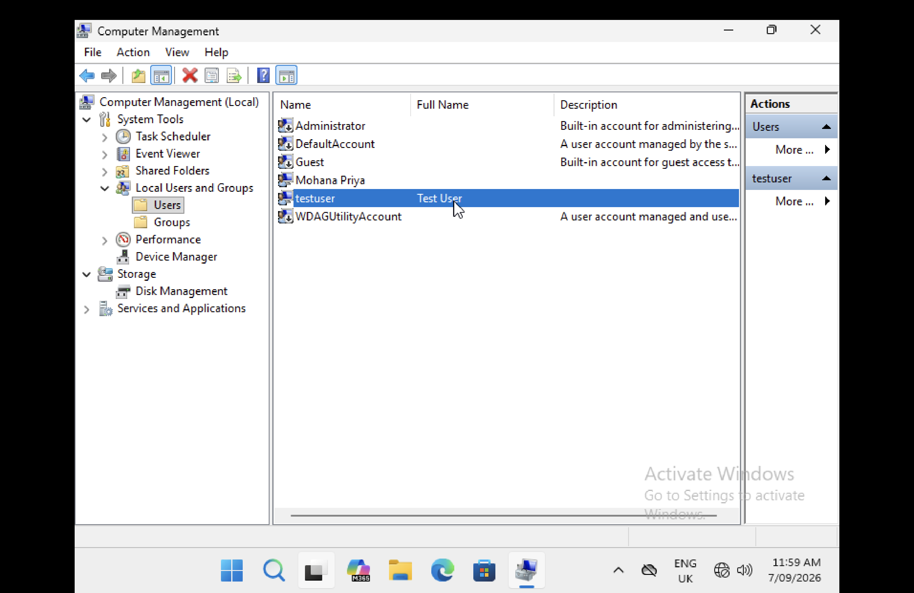

### Learning Outcome

Verified successful creation of the user account within Local Users and Groups.

---

### 5. Reset User Password

**Screenshots**

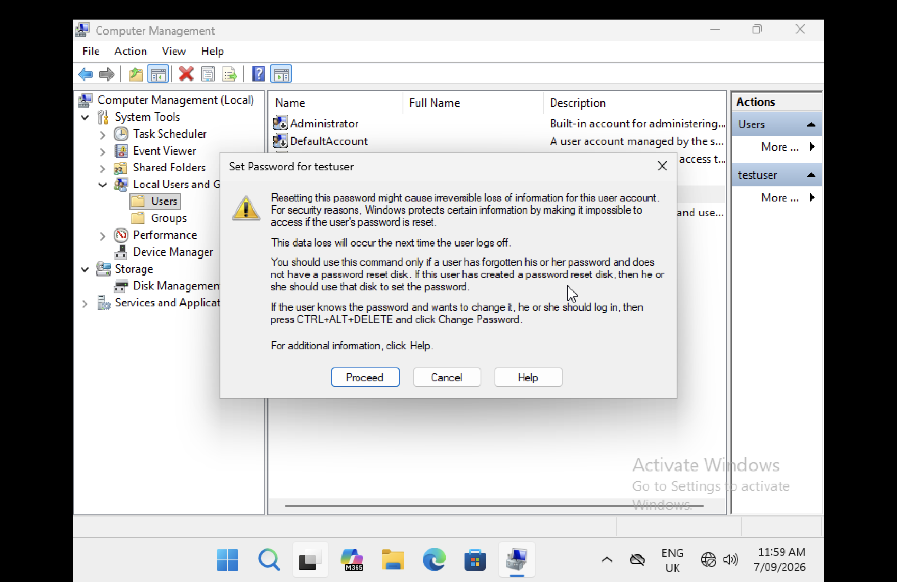
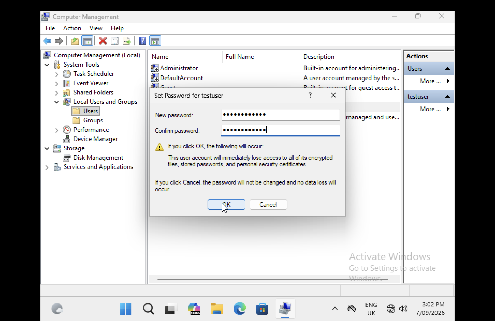

### Learning Outcome

Practised password administration by resetting the test user's password to simulate a common account support scenario.

---

### 6. Disable User Account

**Screenshot**

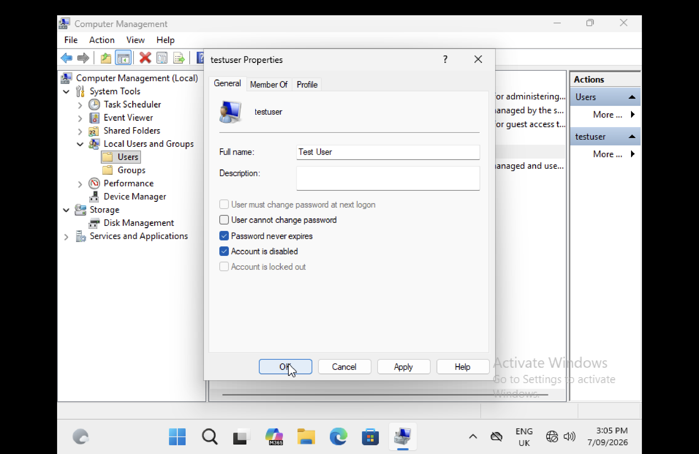

### Learning Outcome

Disabled a user account to simulate account suspension and offboarding scenarios.

---

### 7. Enable User Account

**Screenshot**

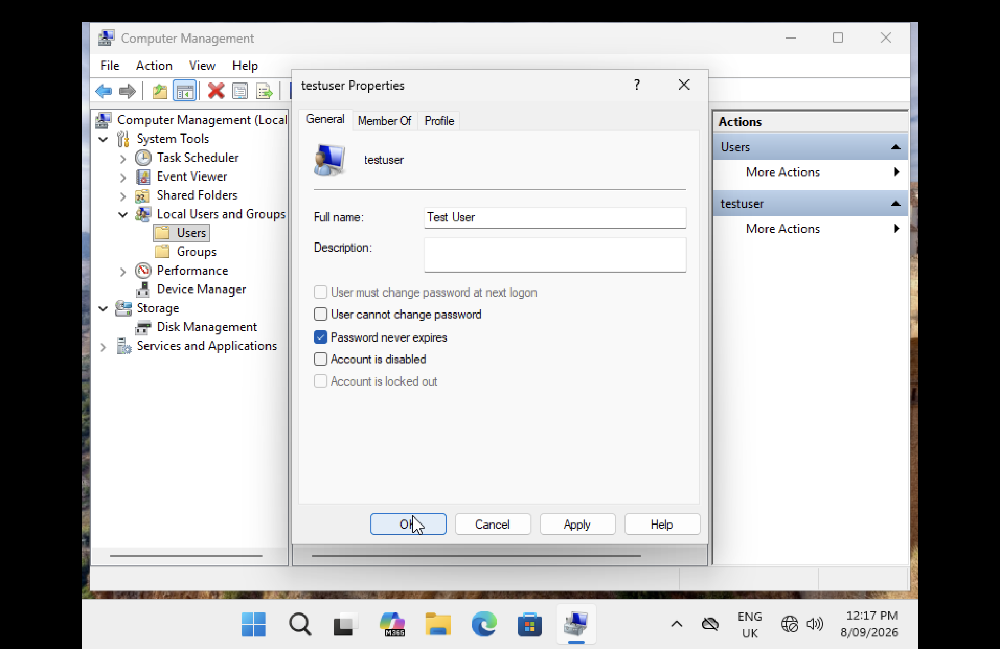

### Learning Outcome

Re-enabled the user account and restored account access.

---

### 8. Manage Group Membership

**Screenshot**

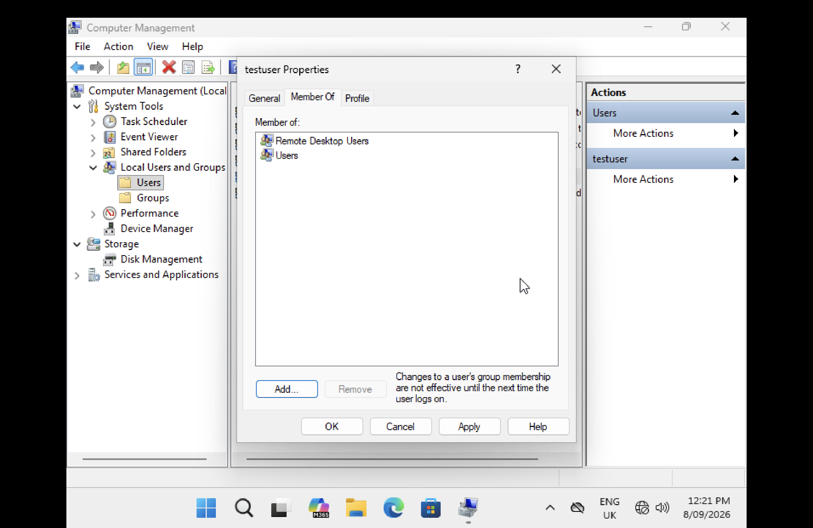

### Learning Outcome

Added the user account to a local security group and reviewed group membership to practise group-based access control.

---

### 9. Delete User Account

**Screenshot**

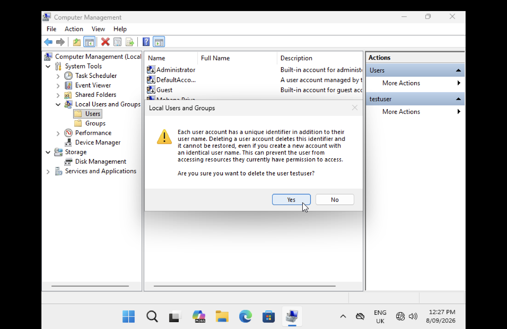

### Learning Outcome

Deleted the test user account to simulate user offboarding and account deprovisioning procedures.

---

### 10. Verify User Deletion

**Screenshot**

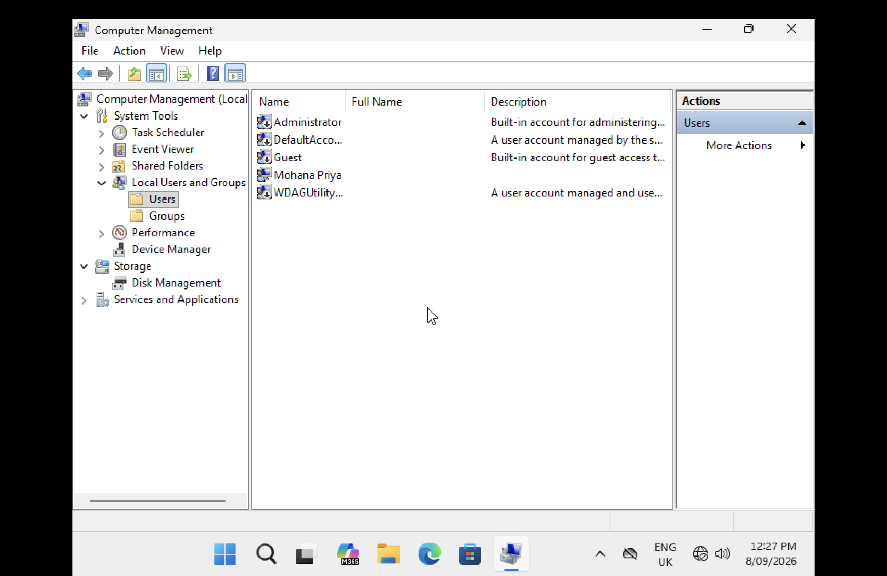

### Learning Outcome

Confirmed that the test user account had been successfully removed from the system.

---

## Security Concepts Practised

- Identity & Access Management (IAM)
- Access Control
- User Provisioning
- Password Administration
- User Deprovisioning
- Group-Based Access Control
- Account Lifecycle Management
- Least Privilege Concepts

---

## Key Takeaways

This lab provided hands-on practice managing local Windows user accounts using administrative tools available within Windows 11.

Through user creation, password management, account enablement and disablement, group membership administration and account deletion, I strengthened my understanding of Identity & Access Management (IAM), access control and user lifecycle administration concepts relevant to IT Support and Service Desk environments.

The lab also reinforced the importance of controlled account provisioning, appropriate access assignment and timely deprovisioning when managing user accounts.

---
